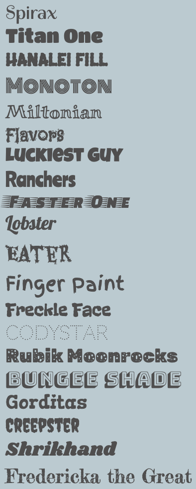

Le projet de démarrage a déjà 20 polices de caractères importées de la bibliothèque Google fonts.

**Astuce :** si tu as utilisé l'une des palettes de couleurs css incluses dans le projet de démarrage, une police correspondante a déjà été attribuée mais tu peux la remplacer.

Les polices incluses sont :

Va dans `default.css` ou le nom du fichier de la palette de couleurs de ton choix (exemple `festival.css`).

Remplace les `header-font`, `title-font` et `quote-font` existants par le nom de la police que tu as choisie :

## --- code ---

language: html
filename: default.css
line_numbers: false
--------------------------------------------------------

\--body-font: 1rem Verdana, sans-serif;
\--header-font: lighter 3rem "spirax", cursive;
\--title-font: lighter 2rem "spirax", cursive;
\--quote-font: lighter 1.5rem "spirax", cursive;

\--- /code ---

Tu peux également ajouter tes variables de police aux classes existantes ou les utiliser lorsque tu crées tes propres classes :

## --- code ---

language: html
filename: default.css
line_numbers: false
line_number_start: 1
line_highlights: 3
-------------------------------------------------------

.bigfont {
font-size: 3rem;
font: var(--header-font);
}

\--- /code ---
