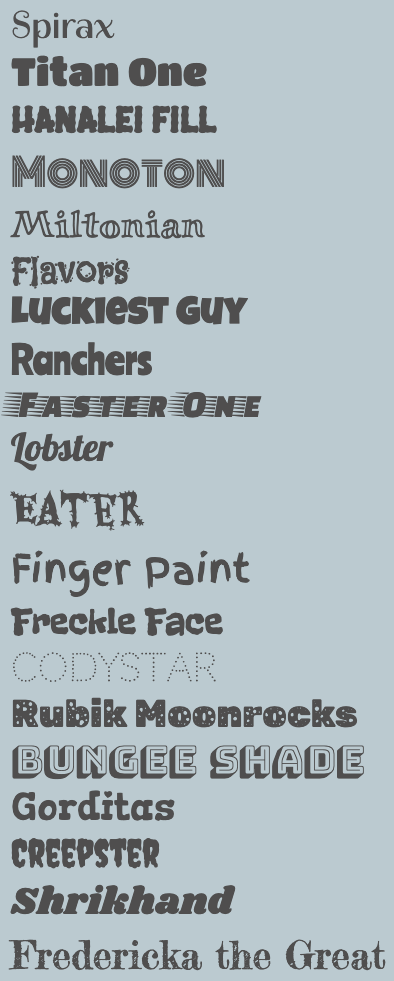

Het startproject heeft 20 lettertypen die al zijn geïmporteerd uit de Google-lettertypen bibliotheek.

**Tip:** Als je een van de css-kleurenpaletten hebt gebruikt die deel uitmaken van het startproject is er al een overeenkomstig lettertype toegewezen maar je kunt het vervangen.

De meegeleverde lettertypen zijn:

Ga naar `default.css` of de bestandsnaam van het door jou gekozen kleurenpalet (bijvoorbeeld `festival.css`).

Vervang het bestaande `header-font`, `title-font` en `quote-font` door de naam van het door jou gekozen lettertype:

## --- code ---

language: html
filename: default.css
line_numbers: false
--------------------------------------------------------

\--body-font: 1rem Verdana, sans-serif;
\--header-font: lighter 3rem "spirax", cursive;
\--title-font: lighter 2rem "spirax", cursive;
\--quote-font: lighter 1.5rem "spirax", cursive;

\--- /code ---

Je kunt ook je lettertype variabelen toevoegen aan bestaande classes of ze gebruiken wanneer je je eigen classes maakt:

## --- code ---

language: html
filename: default.css
line_numbers: false
line_number_start: 1
line_highlights: 3
-------------------------------------------------------

.bigfont {
font-size: 3rem;
font: var(--header-font);
}

\--- /code ---
