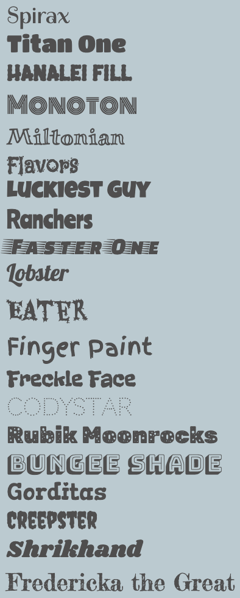

У стартовому проєкті вже є 20 шрифтів, імпортованих з бібліотеки шрифтів Google Fonts.

**Порада:** якщо ти використовуєш одну з колірних палітр CSS, що входять до початкового проєкту, то відповідний шрифт вже призначено. За бажанням ти можеш його замінити.

Ось наявні шрифти:

Перейди до файлу `default.css` або до файлу вибраної колірної палітри (наприклад, `festival.css`).

Заміни наявні `header-font`, `title-font` та `quote-font` назвою вибраного шрифту.

--- code ---
---
language: html
filename: default.css
line_numbers: false
---
  --body-font: 1rem Verdana, sans-serif;
  --header-font: lighter 3rem "spirax", cursive;
  --title-font: lighter 2rem "spirax", cursive;
  --quote-font: lighter 1.5rem "spirax", cursive;

--- /code ---

Ти також можеш додати змінні шрифту до наявних класів або використовувати їх під час створення власних класів.

--- code ---
---
language: html
filename: default.css
line_numbers: false
line_number_start: 1
line_highlights: 3
---
.bigfont {
  font-size: 3rem;
  font: var(--header-font);
}

--- /code ---

